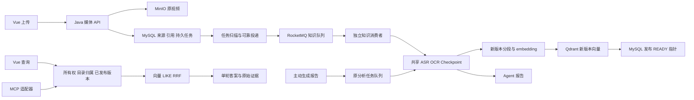

# 当前后端架构

状态：`active`
最后复核：2026-10-07

本页解释当前代码的模块关系与不变量。交付程度和测试数字以 [CURRENT](CURRENT.md) 为准；长期目标见 [目标架构](VIDEO_KB_TARGET_ARCHITECTURE.md)，原 9 月断链现场见 [历史审计](archive/后端架构审计-2026-09-28.md)。当前工作区结构不同于当时运行服务，不能沿用旧图作为现状。

## 业务怎样对应系统

学生复习需要找到讲解、组织多个主题、修正资料并在学习助手里使用。对应的后端核心对象是：内容、归属、任务、已发布版本、授权查询；可选报告是内容的派生产物。

| 边界 | 权威数据或模块 | 负责的事情 |
| --- | --- | --- |
| 内容身份 | MySQL `knowledge_sources`、`media_files` | 同用户媒体去重、来源身份与内容状态 |
| 目录归属 | `knowledge_placements`、空间/目录服务 | 同一内容多处引用；移动或解除某一处 |
| 任务受理/投递 | `knowledge_ingest_jobs`、`KnowledgeIngestJobService` | job 兼任 outbox，投递失败仍留持久记录 |
| 知识处理 | `KnowledgeIngestConsumer/Pipeline` | 独立知识队列、尝试/心跳、提取与索引 |
| 可复用提取 | `VideoPreparationService`、Checkpoint | 共享 ASR/OCR 内容准备，避免报告与入库重复提取 |
| 索引构建/发布 | `KnowledgeSegmentIndexService`、`KnowledgeIndexPublisher` | 新版本分段/embedding/向量写入完成后发布 |
| 授权范围 | `KnowledgeScopeResolver/QueryScope` | owner、placement、目录子树、READY/current version |
| 检索/回答 | `KnowledgeSearchService`、既有问答生成器 | dense/LIKE/RRF；回填证据与单轮回答 |
| 外部接入 | Java `mcp-server` 经 Knowledge API | 五个只读工具；复用后端范围与权限规则 |

## 当前数据流

图中报告与知识任务共用提取服务，但各自有状态和队列。两者共享进程、资源、Checkpoint 与锁，不能称为完全独立的资源隔离。

## 向量化究竟发生在哪里

上传接口完成文件接收、媒体/来源与持久知识任务受理，不等待模型处理。任务扫描器在事务提交后投递 jobId；知识消费者读取任务、调用内容准备，再进入 `indexMedia`。分段后批量调用 embedding，写新 generation 的 Qdrant 点，最后事务发布 MySQL 当前版本。

因此上传成功不等于向量化完成，job 是处理进度，来源 READY 是知识可用。显式重建任务的 `force_rebuild` 区分用户请求与重复投递；已发布内容遇到普通重复消息会跳过。旧转写导入入口仍直接复用相同索引服务，不能说所有资料类型都经过视频 MQ。

持久 job 状态是 QUEUED/PROCESSING/READY/FAILED/CANCELLED；stage 辅助显示提取与索引。自动尝试次数有限，心跳与失联恢复在代码中存在；真实长视频和服务重启仍需专项测试。配置与默认值见 [本次实现报告](architecture/knowledge-lifecycle-20261007.md)。

## 一个视频怎样放在两个文件夹

一份 `source` 对应多条 `placement(sourceId, spaceId, collectionId)`，位置唯一约束使重复添加幂等。目录不是向量索引的独立副本：

- “同时归入”添加 placement，媒体、转写、分段、embedding 都复用。
- 普通拖动移动指定 placement；Alt/Option 拖动添加引用。
- “移除此处引用”只解除选中的位置；最后一个引用不能直接解除。
- 真正删除视频撤销来源和任务，其他归属也失效。
- 创建空文件夹不产生知识；添加引用后其内容会进入该目录的授权检索范围。

旧 `spaceId/collectionId` 字段保留为主归属投影，旧 location 接口仍操作主位置。新查询使用 placements，避免移动目录后依赖过期 Qdrant 位置 payload。完整匹配路径展示与独立内容副本尚未提供。

## 动态更新与版本发布

新 generation 独立保存分段与向量。构建成功后 `KnowledgeIndexPublisher` 锁定 source 并在事务内设置版本 READY 与当前指针；删除或更新指针冲突不得发布。失败标记本次构建，不破坏旧 READY。

查询开始解析已发布版本快照，向量与词法都限定同一范围；回填核对 source/version。返回前再检查所有权、有效归属和删除状态，版本发布期间仍使用本次查询快照，避免命中突然被清空。

当前可靠发布覆盖索引重建与转写生成的新索引。目录 CHANGED 文件仍删除旧资产后再创建，不是完整安全文件替换；旧 generation 没有垃圾回收。问答进行中跨版本回看的一致契约还需要后续验证。

## 检索、问答与库选型

`KnowledgeVectorIndex` 是查询侧抽象，目前由 Qdrant 实现；写入侧仍绑定 Qdrant。过滤到授权 source 与 generation 后召回，词法查询仍为 MySQL LIKE，hybrid 并行召回并做 RRF。向量不可用时可保留词法结果，不表示模型问答或所有模式都不会失败。

当前没有 BM25 和 reranker；RRF 只融合候选排序。保留 Qdrant 是维持已验证基线的当前行为，不说明它在所有负载下优于 Milvus。Milvus 作为候选应在同一语料、切块、embedding、query 和授权过滤条件下对照；切换需双写、回灌、影子查询与回退验证。写入接口抽象与迁移尚未完成。

当前单轮问答沿用既有证据与拒答生成。引用字符串校验不能证明结论语义正确；多轮对话、严格 claim/segment/time 校验和全部必要来源覆盖仍待建设。

## MCP 是否必要

知识库解决内容组织、更新和查询；MCP 解决外部学习助手如何发现并调用同一能力，两者分属不同层。网页直接调用 API，MCP 不应另建一套索引或权限逻辑。

五个只读工具及参数见 [MCP SOP](MCP_SOP.md)。目录工具返回引用与入库状态；search 可指定空间和目录，按 segmentId 去重。省略空间时 search 最多十个 owned spaces、ask 使用默认空间，仍有契约差异。所有 MCP 客户端使用同一个配置的上游主体，不适合直接宣称已实现社区成员隔离。

## 工程观测与源码入口

入库、query embedding、向量/词法召回和融合有有限标签的计时与失败事件，指标不包含用户或问题文本。Actuator 默认仅 health；显式暴露指标后只允许管理员身份。health 不等于完整模型/MQ/向量/媒体链路健康。

实现入口：

- [持久任务/投递](../server/src/main/java/com/example/server/service/KnowledgeIngestJobService.java)、[消费者](../server/src/main/java/com/example/server/consumer/KnowledgeIngestConsumer.java)、[入库管线](../server/src/main/java/com/example/server/service/KnowledgeIngestPipeline.java)。
- [目录引用](../server/src/main/java/com/example/server/service/KnowledgePlacementService.java)、[安全发布](../server/src/main/java/com/example/server/service/KnowledgeIndexPublisher.java)。
- [查询范围](../server/src/main/java/com/example/server/service/KnowledgeScopeResolver.java)、[混合检索](../server/src/main/java/com/example/server/service/KnowledgeSearchService.java)。
- [Vue 工作台](../client/src/KnowledgeLibrary.vue)、[MCP 分发](../mcp-server/src/main/java/com/example/mcp/server/McpDispatcher.java)。

原 9 月审计的断链来源、数据库现场与改进建议保留在 archive，不作为当前服务状态。完整剩余工作见 [活跃队列](MASTER_TODO.md)。
