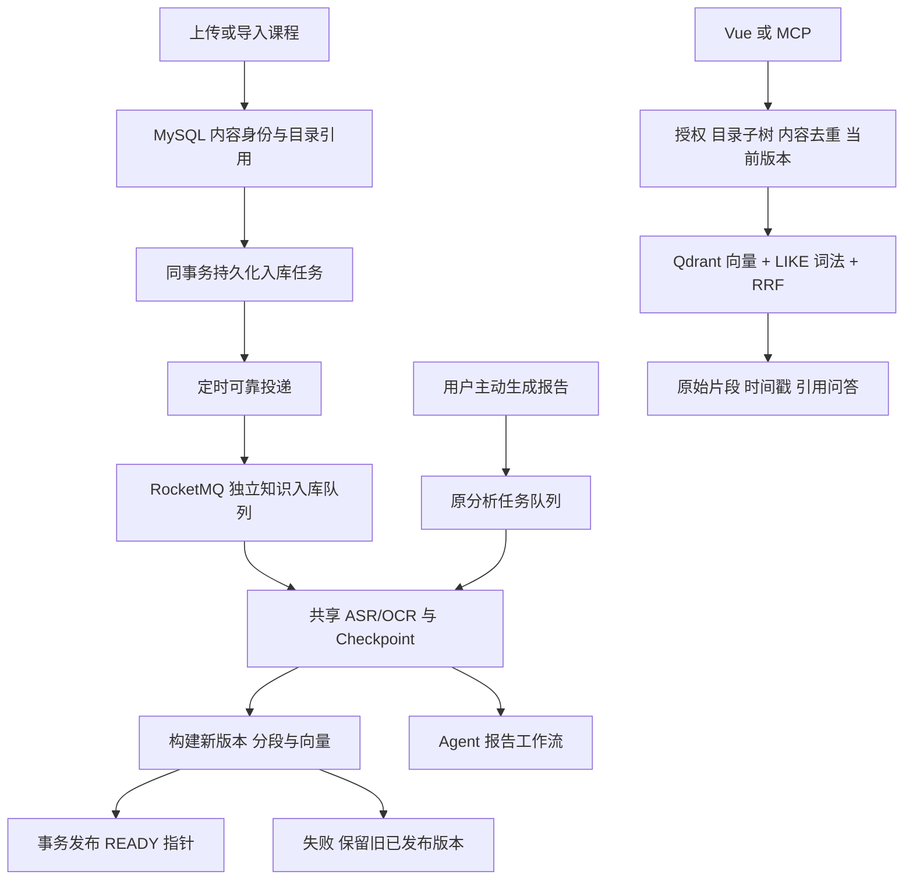

# 视频知识库生命周期改造与验收

状态：`reference`
报告日期：2026-10-07。交付范围：`implemented-local`；未部署生产，未提交 Git。当前状态以 [CURRENT](../CURRENT.md) 为准。

本次将“上传视频后生成报告”调整为“资料先成为可维护、可检索的知识，报告按需单独生成”。业务依据是 [agent.md](../../agent.md) 的 BR-01/02/03/07/08；社区课程复习、跨课程定位和多主题整理是待用户验证的应用假设，不冒充已经发生的学生访谈。

## 业务与实现

| 学习场景 | 本次实现 | 验证边界 |
| --- | --- | --- |
| 上传课程后等待知识可用 | 接收来源时持久化入库 job；独立队列解析、索引，不默认生成 Agent 报告 | 真实 HTTP、数据库、MQ；ASR/OCR 使用确定性替身 |
| 全栈课程同时归入前端和后端 | 一份 source、多条 placement；添加引用、移动指定引用、移除此处引用 | Vue 操作与跨目录检索；不复制媒体、不重复向量化 |
| 修正转写或重建索引 | 新 generation 构建完成后原子发布；失败保留旧 READY 内容 | embedding 故障、新旧版本过滤、并发发布；文件替换仍有遗留 |
| 学习助手找到资料与处理状态 | Web/MCP 使用同一检索授权与范围；新增目录发现工具 | MCP HTTP 链路与用户隔离；未实现社区成员身份映射 |
| 工程人员定位慢与失败阶段 | 分阶段计时、失败事件、持久任务状态、混合负载实验 | 合成语料的工程检查，不能推导真实回答质量与容量 |

图中的解析服务被两个任务复用；报告流程只申请独立入库，不直接执行索引。它们共享基础设施与解析锁，因此不是资源层面的完全隔离。

## 内容、目录、任务、版本的边界

`knowledge_sources` 是内容身份；`knowledge_placements` 是空间/目录归属。V9 迁移从旧主目录字段回填引用，目标位置唯一约束保证重复添加幂等。目录移动不改向量 payload；查询先从 MySQL 的真实归属计算 source 范围。删除目录前阻止遗留引用，移除最后引用被拒绝；真正删除媒体会撤销来源与任务。当前“同时归入”是共享引用，独立复制内容尚未提供。

V9 也新增 `knowledge_ingest_jobs`，保存状态、阶段、尝试次数与投递时间。来源创建和 job 保存共享事务，提交成功后由 outbox 扫描投递。投递竞争通过数据库条件更新控制，消费者通过分布式锁和状态条件更新控制；消息重复投递不直接重复处理已发布来源。V10 的 `force_rebuild` 明确区分重复投递与用户主动重建。

默认入库消费者 2 个线程；任务心跳 30 秒、失联 5 分钟后恢复，自动处理最多 3 次，失败后可显式重试。MQ 投递失败保留 QUEUED 行，后续继续投递。上述时间参数是当前实现值，真实长视频与多实例恢复仍需专项验证。未通过停止共享 MQ 的方式进行实机故障实验；投递异常与竞争由单元测试覆盖。

索引构建保留旧段与旧向量，新增版本和分段后完成 embedding/Qdrant 写入，最后由 `KnowledgeIndexPublisher` 事务切换当前版本指针。新版本失败不能将已发布旧版本标成 FAILED。查询只召回当前已发布 generation；一次查询保留开始时的版本快照，并在返回前再次检查当前所有权、归属和删除状态，避免并发发布让结果突然为空。引用接口提供当前已发布的原始片段。

查询侧新增 `KnowledgeVectorIndex`，Qdrant 是当前实现；写入侧仍使用 Qdrant，尚未做到完整可替换 `VectorStore`。Qdrant 按用户、source 与 generation 过滤后取 TopK，不再靠易过期的目录 payload 决定归属。过滤集合按 200 个来源拆分后合并；大规模空间的查询成本尚需测试。

## Web、MCP 与监测

Vue 新增“同时归入”和“移除此处引用”，拖动移动当前引用，Alt/Option 拖动添加引用；入库状态来自独立 job。后台重建失败时旧知识仍 READY，界面显示任务失败并允许重试。

新增接口：

- `GET/POST /knowledge/sources/{sourceId}/placements`、`PATCH/DELETE /knowledge/sources/{sourceId}/placements/{placementId}`。
- `GET /knowledge/ingest-jobs`、`POST /knowledge/ingest-jobs/sources/{sourceId}/retry`。
- `GET /knowledge/spaces/{spaceId}/catalog`，返回授权目录、内容、引用和任务状态。

MCP 提供五个只读工具，包括 `get_knowledge_catalog`；search 支持指定目录。未指定空间的 search 最多访问十个拥有的空间，跨空间按 segmentId 去重；ask 仍按已有默认空间语义工作，不声称两者无参数时范围相同。MCP 客户端统一使用配置的上游账号，这是个人/服务账号适配器；不具备社区不同成员分别授权的公开服务能力。

Actuator 默认只暴露 health。通过 `MANAGEMENT_EXPOSURE=health,prometheus,metrics` 显式开启后，指标端点必须携带管理员身份，普通用户 403、匿名 401；health 不输出内部细节。提供提取、分段、embedding、向量写入、发布、查询 embedding、词法/向量召回和混合检索的计时与失败事件。指标标签只保留有限阶段/结果，避免用户或问题文本产生高基数。成本和真实质量指标仍未完成。

## 验收证据

2026-10-07 最后回归：后端 **163**、MCP **13**、前端 **2** 个测试全部通过；前端生产构建成功。后端覆盖任务幂等/重试、归属竞争、发布失败、删除、查询期间归属撤销与版本切换等行为。

隔离环境使用单独数据库 `videoagent_arch_20261007`、Redis DB 13、独立 Qdrant collection 与 MQ topic。MySQL/Flyway、Redis、RocketMQ、Qdrant、MinIO、Spring HTTP 与 MCP HTTP 为真实基础设施；解析、chunk 与 embedding 为确定性替身，Agent 报告注入预算失败。上传的是合成字节，不是可播放的真实视频。

- [架构链路与混合负载报告](../../eval/reports/architecture-smoke-20261007.json)：33 项检查通过，涵盖持久任务、无报告入库、多归属、子目录、三种检索、租户拒绝、失败保留、主动重建、新旧版本、撤销引用、报告失败隔离和管理员指标；另以并发 8 执行 90 次检索，混合 18 次状态查询与 1 次重建。
- [MCP 链路报告](../../eval/reports/mcp-architecture-smoke-20261007.json)：11 项检查通过，涵盖五工具发现、目录与状态、跨空间去重、目录过滤、证据、客户端鉴权。
- [Vue 页面验收截图](../../eval/reports/architecture-ui-20261007.jpg)：添加/移除共享引用与混合检索结果；真实播放和新回答质量不在本次验收范围。

可通过 `bash scripts/architecture-fixture.sh` 启动测试运行时，再执行 `python3 eval/architecture_smoke.py`；需提前创建隔离数据库。运行时位于 test 源码，故障注入接口不进入生产包。脚本只保存断言与耗时，测试令牌仅留在本机受限临时文件，不进入报告。不得把测试数据库替换为生产库。

这些证据证明本次结构行为，不证明真实 ASR 准确率、跨视频完整回答、检索 Recall、学生价值、生产 P95 或容量。9 月真实语料报告保持其历史范围，本次未重新运行该质量集。

## 未完成与上线边界

1. 关键词仍是 MySQL LIKE；BM25、reranker、Milvus 对照/双写/回灌尚未实现，现有 RRF 不是精排。下一步固定真实问题与原始片段标注，比较 dense、lexical、融合、重排；达到指标后再决定库迁移。
2. 多轮会话、指代消解、结论级 claim 校验、语义分段与社区成员共享权限尚未新增。不能将本次目录共享称为不同学生之间的资料共享。
3. 本地目录 CHANGED 文件仍删除旧资产后创建新资产，未统一为稳定内容身份的资产版本替换。当前可靠发布覆盖索引重建/转写索引，不覆盖所有文件更新场景。
4. 旧 generation 保留但尚无垃圾回收；真实大语料、恢复后堆积、长视频、上传并发、Token 成本与 ASR 分片恢复仍需评测。
5. 新目录移动不再同步旧向量的 space/collection payload。旧接口兼容主归属操作，但回滚旧后端需要修复或重建该 payload，不能直接当作无数据修复的回滚。
6. 尚未部署生产。上线前备份并验证 V9/V10，明确上传不再默认出报告的产品变化，重新跑现有真实语料问答、导入与播放回归，并确认 MCP 服务账号范围。

社区验证应招募真实学生进行课程复习任务，收集原问题、找资料耗时、正确片段和答案评价。可先用 10–15 名学生与约 30 个真实问题建立首批质量集；这些数量是建议，尚无对应调研结果。
