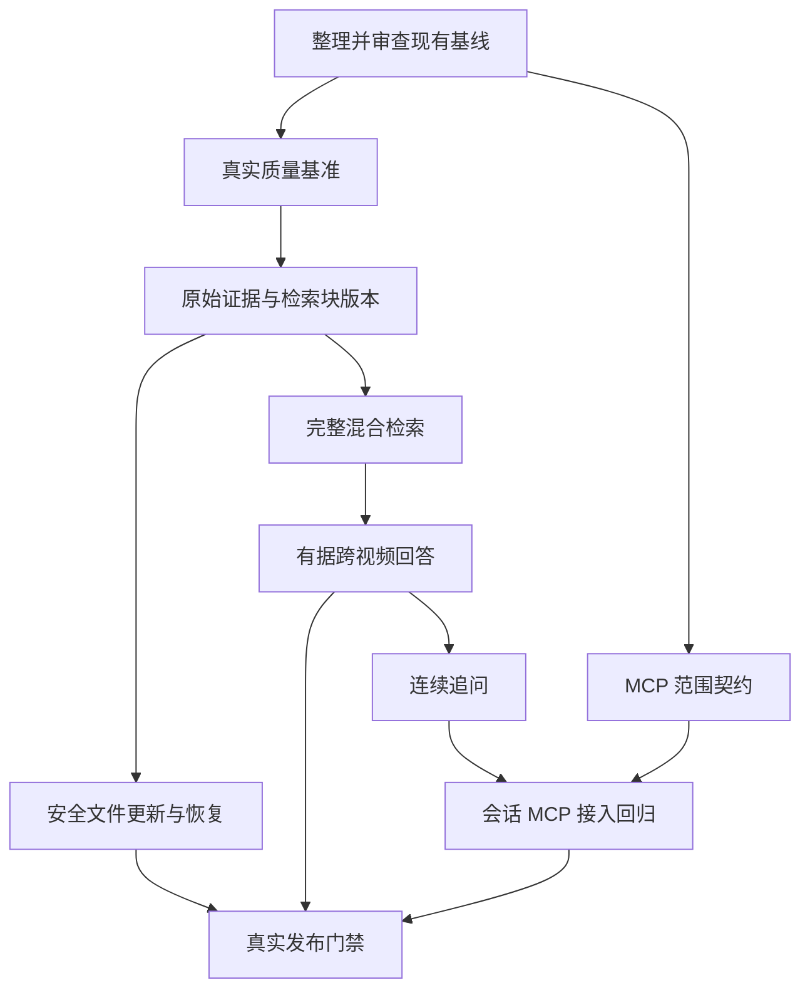

# Git 分支与工程交付计划

状态：`active`

最后复核：2026-10-08

负责人已批准并要求实施本计划。首期完成学生个人学习闭环；多人社区共享与 Milvus 迁移独立交付。采用 main + 短期分支 + PR，同时最多两个开发分支。编号表示依赖，不是工期承诺。事实见 [CURRENT](../CURRENT.md)，业务关闭条件见 [MASTER_TODO](../MASTER_TODO.md)。

## 当前 Git 状态与基线

当前分支 `fix/upload-knowledge-reliability`，原 HEAD `2e870ec` 的 40 个提交已保留，生命周期基线提交 `afdde54`；同步远端后另有 12 个上游提交，已整合并回归。当前账号对上游只有读取权限，使用 fork PR，本地集成不代表原仓库已合入。

先清点历史 40 个提交与工作区差异，标明用户已有修改和本次成果，保留原分支及完整历史。在现有开发线上整理可审查的基础交付：持久 job/outbox、目录引用、generation、授权范围、Vue/MCP、迁移、指标、测试与文档。

本次改动共享 source、scope、索引和消费者契约，不能靠按文件机械拆分，生成无法编译的“数据库 PR”“后端 PR”“前端 PR”。可以按依赖顺序整理提交，但每个拟合入的 PR 必须能编译、迁移并跑业务链路。未检查过的历史提交、用户原有 embedding 实验报告等不直接混入新改动提交。

已有开发线形成基线并审查合入后，新业务分支从已合入的 main 创建。若基线 PR 尚未合入而必须继续，用明确的父分支建立依赖 PR；父 PR 合入后更新子分支到 main。不要同时维护长期 main/develop/功能集成三套事实。

## 分支交付单元

表格按依赖组织，不表示所有事项同时开展。每个分支都包含必要后端、页面/MCP、测试与文档；较大的分支通过多个可独立通过检查的 PR 完成。

| 分支建议 | 依赖与业务要求 | 主要开发内容 | 通过后学生能获得什么 |
| --- | --- | --- | --- |
| 现有 `fix/upload-knowledge-reliability` 收敛基线 | 起点；BR-01/02/03/07/08 | 审查历史与现有实现、验证 V9/V10、补基础 CI、真实上传/回看回归 | 视频可靠入库、多主题整理、重建失败仍能查询旧知识 |
| `test/evidence-benchmark` | 基线；BR-04/06/08 | 新版本真实问题集、必要 source/segment/time 标注、开发集/保留集、旧策略基准 | 有依据判断答案是否找全、引用是否准确，而非只看命中来源 |
| `feat/evidence-chunking` | 基线及质量基准；BR-03/04/06 | 原始证据与检索块分离、语义/长度分块、父块映射、parser/chunk/embedding profile、避免重复向量调用 | 一个完整知识点被检索，引用准确回到原始时间窗 |
| `feat/lexical-bm25` → `feat/retrieval-rerank` | 证据模型与质量基准；BR-04 | BM25 词法方案、双路召回/RRF、可配置 reranker、子问题召回与候选覆盖、确定性降级 | 概念表达和精确术语都能找到，跨视频问题有完整证据候选 |
| `feat/claim-evidence-answers` | 证据与混合检索；BR-04/06 | claim 对指定证据校验、原文/版本/时间一致、部分答案与缺证据说明、统一引用输出 | 综合多个视频回答且每个关键结论有对应依据 |
| `feat/content-update-recovery` | 基线及版本证据契约；BR-01/03/08 | CHANGED 安全资产替换、任务恢复实测、删除对账、历史版保留/清理、失效证据处理 | 新文件失败不丢旧资料，失败能恢复，删除能生效 |
| `feat/conversation-qa` | 有据回答与证据契约；BR-05/06 | 会话绑定主体/scope、指代解析、每轮检索、切换范围、预算、Vue 会话与 MCP 参数 | 接着问“它为什么这样实现”能正确理解，范围切换不串资料 |
| `feat/query-scope-contract` | 基线；会话扩展依赖会话契约；BR-07 | search/ask 默认范围对齐、显式 scope、未就绪说明、五工具回归、兼容变更 | 外部助手在同一知识范围得到与网页一致的查询行为 |
| `test/video-kb-release` | 上述交付组合；BR-08 | 真实多语料质量、混合负载、恢复/成本、升级回退、完整 Web/MCP 演示和报告 | 从“能跑功能”推进到可说明效果、容量和恢复边界的产品 |

多人社区与向量库迁移是有条件的独立交付：

- `feat/community-knowledge-access`：确认共享对象、成员角色及撤销规则后开发空间成员与主体绑定；替换当前 MCP 单上游账号模型。先做两主体隔离测试，再开放社区。当前默认规则不因本计划而改变。
- `spike/vector-backend-comparison`：固定同一数据/模型/profile 与授权过滤，比对候选引擎，不默认切换生产库。实验证明需要迁移后，才进入 `feat/vector-store-migration` 的写入抽象、双写、回灌、影子查询与受控切读。

## 依赖关系

代码依赖不等于适合多名开发者立即并行。source/version/evidence schema、QueryScope 和检索输出模型是共同边界，先固定契约再拆独立工作。共享数据库上的 Flyway 版本号在 PR 合入顺序中统一分配；已在共享/生产环境执行的迁移不可重写，各分支新增迁移需检查编号冲突。

## 每一类分支怎样拆 PR

### 基线

先完成改动归属与接口/迁移审查，再把既有成果整理为构建完整的提交序列。测试、迁移和业务说明跟随行为变化，文档索引整理可以单独成提交。现有生成报告改为主动触发、目录引用和旧向量 payload 回退限制必须出现在 PR 描述，不能只写“优化后端”。

CI 已加入 server/MCP 测试、前端与扩展测试/构建、文档链接检查。新增独立基础设施 fixture 入口；本机隔离链路不代表 CI 已执行完整集成。

### 证据与向量化

先定义 evidence/retrieval block/profile 契约与增量 schema，保留现行读取路径；再新增语义/长度分块、原始时间映射与按 profile 幂等的 embedding。原始转写/OCR 用于引用，派生摘要只辅助检索，避免同一五分钟摘要重复附着造成难以区分的候选。

不同策略通过 profile 切换，回灌构造独立 generation；质量集固定后对照旧策略，不能边改 Golden 边证明提升。迁移模型或维度时必须使用兼容的索引隔离，不能把不同维度写入同一个已配置 collection 后直接切读。当前配置/Qdrant 写入路径的扩展在该契约下审查。

### 混合检索

依次交付词法接口与 BM25 承载方案、RRF 与范围契约、reranker 和超时降级、复合问题的证据覆盖。词法承载组件需通过小实验决定，本计划不预定新增搜索集群或更换 Qdrant。

比较 dense、lexical、RRF、RRF+reranker，分别记录片段/全部必要来源覆盖、术语命中、阶段延迟与成本。不要为了“跨视频”强制拼入无关视频；应对问题的每个证据需求检查是否找到支持，并在缺失时说明。

### 有据回答和会话

先保证单轮 claim 与 evidence 的身份、原文、版本、时间关系，再接会话。历史回答不是新的知识来源；每轮按当前授权重新检索，删除/撤权后不可继续借历史引用输出。改写问题只能帮助检索，不能引入用户没说的事实。

Vue 要呈现完整答案、引用、缺口与继续追问；MCP 会话参数保持主体绑定并声明兼容版本。代码、单测与页面走查都完成后，仍需真实问题的答案质量与时间回看验收。

### 更新、恢复与清理

先完成稳定 source 身份下的新资产 staging、成功发布与失败保留，再做历史版垃圾回收。清理策略必须考虑活动查询/引用；删除优先撤销可检索资格，存储清理随后对账。实测进程退出、消息重复/滞留、MQ 恢复、embedding/向量写入失败和删除竞争；不在共享产品基础设施上直接停止服务做实验。

## 每个 PR 的共同合并门槛

1. 一句话明确触发情境与前后行为，回链对应 BR、验收与范围；不以函数数量或换组件作为价值说明。
2. 构建完整，server/MCP/前端相关检查通过；数据库迁移前后与 HTTP/MCP 契约有证据。
3. 行为相应的故障、重复、版本、scope/越权测试通过；前端业务变化有页面操作验收。
4. 质量变更在固定版本集跑基准与保留集；结构变更跑隔离链路；昂贵真实模型运行显式触发并记录配置/费用。
5. 同步 agent.md 对应 BR、CURRENT、MASTER_TODO、架构、SOP/兼容与报告；README 仅维护入口。
6. profile/开关、迁移影响与回退前提清楚。真实容量、质量或恢复未测时，如实保留未验收范围。

质量和延迟阈值需在真实基准建立后按业务确认；零越权/已发布数据不被失败破坏等不变量不能用平均分掩盖。结构测试不证明学生回答正确，质量报告也不代替升级恢复验证。

## 产品里程碑

- 第一阶段：当前基线可审查、可迁移、真实课程可以可靠入库与多主题整理。
- 第二阶段：跨视频复合问题能找全必要证据，回答与时间引用可核验，有固定质量与成本报告。
- 第三阶段：学生可连续追问，网页与 MCP 使用同一范围契约，更新/恢复与发布门禁通过。
- 社区多人阶段：需求与授权规则明确后，完成主体绑定、共享/撤销与隔离验收，再对外开放。

上述是建议依赖与交付方式，不承诺日历工期，也不以本页替代业务队列。正式开始某项时，创建对应分支与具体范围文档，并将实际分支/PR/证据回链到队列。

## 已批准的精确依赖与契约

主线：0 基线 → 1 benchmark → 2 chunking → 4 BM25 → 5 rerank → 6 claims → 7 conversation。支线：0 → 3 scope、2 → 8 recovery；9 依赖 3、7、8。4 同时依赖 2、3。

2 负责 raw evidence/retrieval block/version/time/profile 契约；3 负责范围契约：网页传当前空间，会话绑定范围，独立 MCP 省略范围时使用默认空间。5 只负责候选，6 负责结论支撑；7 增加会话创建与消息读取、ask conversationId，每轮重新检索；8 复用版本契约。

Qdrant 为首期默认库；BM25 承载在 4 内实验选择。Flyway 按合入顺序分配，已执行迁移不重写；基线保留历史，后续 PR squash，父功能合入后同步 main 并重新检查。每个 PR 回链业务要求、证据与兼容影响，同步 agent、状态、队列、架构、SOP 和报告。首期交付不授予社区开放或生产发布权限。
